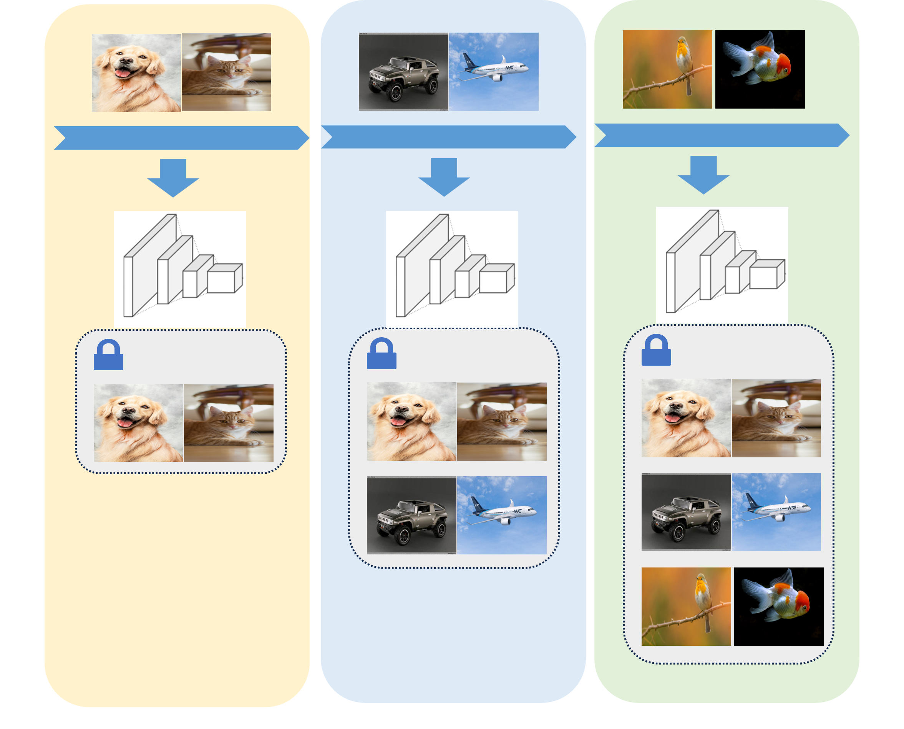

<!--# LibContinual-->
<div align="center">
  <h1>LibContinual: Make Continual Learning Easy</h1>
<!--   <h3>Make Continual Learning Easy</h3> -->
    
</div>

## Introduction
<div style="text-align: justify">
LibContinual is an open-source continual learning toolbox based on PyTorch. The framework currently supports PyTorch 1.13+ (compatibility with earlier versions not fully guaranteed) and provides comprehensive implementations of state-of-the-art continual learning algorithms.
</div>

<!---->


## Supported Methods
### Conventional methods
+ [LwF (ECCV 2016)](https://github.com/RL-VIG/LibContinual/blob/master/reproduce/lwf/README.md): Learning without Forgetting.
+ [EWC (PNAS 2017)](https://github.com/RL-VIG/LibContinual/blob/master/reproduce/ewc/README.md): Overcoming catastrophic forgetting in neural networks.
+ [iCaRL (CVPR 2017)](https://github.com/RL-VIG/LibContinual/blob/master/reproduce/icarl/README.md): Incremental Classifier and Representation Learning.
+ [BiC (CVPR 2019)](https://github.com/RL-VIG/LibContinual/blob/master/reproduce/bic/README.md): Large Scale Incremental Learning.
+ [LUCIR (CVPR 2019)](https://github.com/RL-VIG/LibContinual/blob/master/reproduce/lucir/README.md): Learning a Unified Classifier Incrementally via Rebalancing.
+ [WA (CVPR 2020)](https://github.com/RL-VIG/LibContinual/blob/master/reproduce/wa/README.md): Maintaining Discrimination and Fairness in Class Incremental Learning.
+ [OCM (ICML 2022)](https://github.com/RL-VIG/LibContinual/blob/master/reproduce/ocm/README.md): Online Continual Learning through Mutual Information Maximization.
+ [ERACE, ERAML (ICLR 2022)](https://github.com/RL-VIG/LibContinual/blob/master/reproduce/erace,eraml/README.md): New Insights on reducing abrupt representation change in online continual learning.
+ [GPM (ICLR 2021)](https://github.com/RL-VIG/LibContinual/blob/master/reproduce/gpm/README.md): Gradient Projection Memory for Continual Learning.
+ [TRGP (ICLR 2022)](https://github.com/RL-VIG/LibContinual/blob/master/reproduce/trgp/README.md): Trust Region Gradient Projection for Continual Learning.
+ [API (CVPR 2023)](https://github.com/RL-VIG/LibContinual/blob/master/reproduce/api/README.md): Adaptive Plasticity Improvement for Continual Learning.
+ [RanPAC (NeurIPS 2023)](https://github.com/RL-VIG/LibContinual/blob/master/reproduce/ranpac/README.md): Random Projections and Pre-trained Models for Continual Learning.
<!-- + [PRAKA (ICCV 2023)](https://github.com/RL-VIG/LibContinual/blob/master/reproduce/praka/README.md): Prototype Reminiscence and Augmented Asymmetric Knowledge Aggregation for Non-Exemplar Class-Incremental Learning. -->
<!-- + [DER (CVPR 2021)](https://github.com/RL-VIG/LibContinual/blob/master/reproduce/der/README.md): Dynamically Expandable Representation for Class Incremental Learning. -->

### Foundation model based methods
+ [L2P (CVPR 2022)](https://github.com/RL-VIG/LibContinual/blob/master/reproduce/l2p/README.md): Learning to Prompt for Continual Learning.
+ [DualPrompt (ECCV 2022)](https://github.com/RL-VIG/LibContinual/blob/master/reproduce/dualprompt/README.md): Complementary Prompting for Rehearsal-free Continual Learning.
+ [CodaPrompt (CVPR 2023)](https://github.com/RL-VIG/LibContinual/blob/master/reproduce/codaprompt/README.md): COntinual Decomposed Attention-based Prompting for Rehearsal-Free Continual Learning.
+ [InfLoRA (CVPR 2024)](https://github.com/RL-VIG/LibContinual/blob/master/reproduce/inflora/README.md):  Interference-Free Low-Rank Adaptation for Continual Learning.
+ [MoE_Adapter4CL (CVPR 2024)](https://github.com/RL-VIG/LibContinual/blob/master/reproduce/moe_adapter4cl/README.md): Boosting Continual Learning of Vision-Language Models via Mixture-of-Experts Adapters.
+ [RAPF (ECCV 2024)](https://github.com/RL-VIG/LibContinual/tree/master/reproduce/rapf): Class-Incremental Learning with CLIP: Adaptive Representation Adjustment and Parameter Fusion.
+ [SD_LoRA (ICLR 2025)](https://github.com/RL-VIG/LibContinual/blob/master/reproduce/sd_lora/README.md): Scalable Decoupled Low-Rank Adaptation for Class Incremental Learning

<!-- ## Quick Installation

Please refer to [`install.md`](https://libcontinual.readthedocs.io/en/latest/docs/install.html) <br>
Complete tutorials can be found at [`./docs`](https://libcontinual.readthedocs.io/en/latest/)
-->

## Installation
Please refer to [`install.md`](https://libcontinual.readthedocs.io/en/latest/docs/install.html) <br>
Complete tutorials can be found at [`./docs`](https://libcontinual.readthedocs.io/en/latest/)


## Datasets
- CIFAR-10 is avaliable at [Google Drive](https://drive.google.com/drive/folders/1sl2aW1sRpEfQJuJZwajXO2QhR06gQYZx?usp=drive_link) <br>
- CIFAR-100 is available at [Google Drive](https://drive.google.com/drive/folders/1EL46LQ3ww-F1NVTwFDPIg-nO198cUqWm?usp=sharing)  <br>
- CUB200, ImageNet-R, Tiny-Imagenet, 5-Dataset are available at [Google Drive](https://drive.google.com/drive/folders/16afRW2952coWJSbiH7cZT1b8pRibA8nH?usp=sharing)  <br>

After the dataset is downloaded, please extract the compressed file to the specified path.
```
unzip cifar100.zip -d /path/to/your/dataset
```
Set the `data_root` in `.yaml`：
```
data_root: /path/to/your/dataset
```
To add a custom dataset, please refer to [`dataset.md`](https://libcontinual.readthedocs.io/en/latest/docs/data_module_en.html).

## Getting Started

Once you have completed the "Installation" and "Datasets" sections, you can now proceed to demonstrate how to use the "LibContinual" framework with the [`LUCIR`](https://github.com/RL-VIG/LibContinual/blob/master/reproduce/lucir/README.md) method. 

- **Step1:** Configure the parameters in the `./config/lucir.yaml` file. Please refer to [`config.md`](https://libcontinual.readthedocs.io/en/latest/docs/config_file_en.html) for the meanings of each parameter.
- **Step2:** Run code `python run_trainer.py --config lucir.yaml`
- **Step3:** After the training is completed, the log files will be saved in the path specified by the `save_path` parameter.

## Benchmarks

We adopt standardized evaluation metrics from continual learning literature. Given T tasks where $R_{t,i}$ represents the accuracy of model after training on task $t$ when tested on task $i$:

<!--
* $T \in [1, \text{task num}]$
* $R_{t,i}$ be accuracy of **model after training on task $t$ being test on test data of task $i$**
* $R_{t,{i\sim j}}$ be accuracy of **model after training on task $t$ being test on test data of task $i\sim j$**
-->

### Evaluation Metrics

#### **1.** Last Average Accuracy 
$$ 
 Acc_T=R_{T, {0\sim T}} \quad (1)
$$


#### **2.** Backward Transfer (BWT)
$$ 
 BWT_T = \frac{\sum_{i=3}^T\sum_{j=1}^{i-2}R_{i,j}-R{j,j}}{T(T-1)/2} \quad (2)
$$

#### **3.** Forgetting 
$$ 
 Frgt_T = \frac{\sum_{j=1}^{T-2}R_{T-1,j}-R_{j,j}}{T-1} \quad (3)
$$
> Equivalent to Positive BwT in ["new metrics for Continual Learning"](https://arxiv.org/pdf/1810.13166)

<!--
#### **4.** Overall Average Accuracy (Batch Version) 
$$ 
 \overline{Acc_T}=\frac{1}{T}\sum_{t=1}^T(R_{t,{0\sim T}}) \quad (4)
$$
-->
#### **4.** Overall Average Accuracy
$$ 
 \overline{Acc_T}=\frac{1}{T}\sum_{t=1}^T(\frac{1}{t}\sum_{i=1}^t R_{t,i}) \quad (4)
$$
<!--
> **Note**:  
> - “Overall” and “Batch“ versions are equivalent when initial class count equals incremental class count

> - Implementation follows: **Lucir** (Task), **Praka** (Batch)
-->

<!--
### \[Batch\] Last Average Accuracy

> $Acc_T=R_{T, {0\sim T}}$

### Backward Transfer 

> Equivalent to Positive BwT of Continuum
> 
> https://arxiv.org/pdf/1810.13166
> 
> $BWT_T = \frac{\sum_{i=3}^T\sum_{j=1}^{i-2}R_{i,j}-R{j,j}}{T(T-1)/2}$

### Forgetting

> Equivalent to Forgetting of Continuum
> 
> $Frgt_T = \frac{\sum_{j=1}^{T-2}R_{T-1,j}-R_{j,j}}{T-1}$

### \[Batch\] Overall Average Accuracy

> $\overline{Acc_T}=\frac{1}{T}\sum_{t=1}^T(R_{t,{0\sim T}})$

### \[Task\] Overall Average Accuracy

> $\overline{Acc_T}=\frac{1}{T}\sum_{t=1}^T(\frac{1}{t}\sum_{i=1}^t R_{t,i})$

Note: 
* \[Batch\] Overall Average Accuracy and \[Task\] Overall Average Accuracy are equal if initial num of classes equal to increment num of classes
* We keep both implementation of Overall Average Accuracy as **Lucir** use \[Task\] in its original experiment, while **Praka** use \[Batch\]. 

### Overall Forgetting

> $\overline{Frgt_T} = \frac{1}{T-2}\sum_{t=3}^TFrgt_{t}$

### Overall Backward Transfer

> $\overline{BWT_T} = \frac{1}{T-2}\sum_{t=3}^TBWT_{t}$
-->

## Acknowledgement
LibContinual is an open source project designed to help continual learning researchers quickly understand the classic methods and code structures. We welcome other contributors to use this framework to implement their own or other impressive methods and add them to LibContinual. This library can only be used for academic research. We welcome any feedback during using LibContinual and will try our best to continually improve the library.
Special thanks to the authors of [FACIL](https://github.com/mmasana/FACIL) and [PyCIL](https://github.com/G-U-N/PyCIL) for their inspiration on framework design.

<!--This project has been developed with references to the following repositories:

- [FACIL](https://github.com/mmasana/FACIL)
- [PyCIL](https://github.com/G-U-N/PyCIL)
-->


We have referenced useful modules from these repositories in our work. We deeply appreciate the authors of these repositories.

## License
This project is licensed under the MIT License. See LICENSE for more details.
