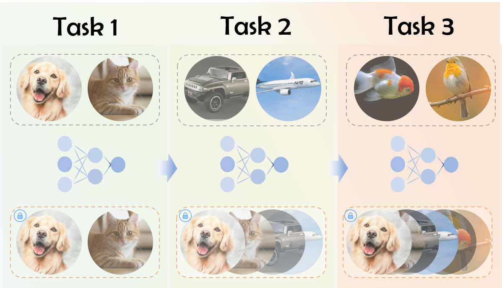

# LibContinual
Make continual learning easy.

## Introduction
LibContinual is an open source continual learning toolbox based on PyTorch. The master branch works with PyTorch 1.13. The compatibility to earlier versions of PyTorch is not fully tested.




## Supported Methods
### Conventional methods
+ [LwF (ECCV 2016)](https://github.com/RL-VIG/LibContinual/blob/master/reproduce/lwf/README.md)
+ [EWC (PNAS 2017)](https://github.com/RL-VIG/LibContinual/blob/master/reproduce/ewc/README.md)
+ [iCaRL (CVPR 2017)](https://github.com/RL-VIG/LibContinual/blob/master/reproduce/icarl/README.md)
+ [BiC (CVPR 2019)](https://github.com/RL-VIG/LibContinual/blob/master/reproduce/bic/README.md)
+ [LUCIR (CVPR 2019)](https://github.com/RL-VIG/LibContinual/blob/master/reproduce/lucir/README.md)
+ [WA (CVPR 2020)](https://github.com/RL-VIG/LibContinual/blob/master/reproduce/wa/README.md)
+ [DER (CVPR 2021)](https://github.com/RL-VIG/LibContinual/blob/master/reproduce/der/README.md)
+ [OCM (ICML 2022)](https://github.com/RL-VIG/LibContinual/blob/master/reproduce/ocm/README.md)
+ [ERACE,ERAML (ICLR 2022)](https://github.com/RL-VIG/LibContinual/blob/master/reproduce/erace,eraml/README.md)
+ [TRGP (ICLR 2022)](https://github.com/RL-VIG/LibContinual/blob/master/reproduce/trgp/README.md)
+ [PRAKA (ICCV 2023)](https://github.com/RL-VIG/LibContinual/blob/master/reproduce/praka/README.md)
+ [RanPAC (NeurIPS 2023)](https://github.com/RL-VIG/LibContinual/blob/master/reproduce/ranpac/README.md)

### Foundation model based methods
+ [L2P (CVPR 2022)](https://github.com/RL-VIG/LibContinual/blob/master/reproduce/l2p/README.md)
+ [DualPrompt (ECCV 2022)](https://github.com/RL-VIG/LibContinual/blob/master/reproduce/dualprompt/README.md)
+ [CodaPrompt (CVPR 2023)](https://github.com/RL-VIG/LibContinual/blob/master/reproduce/codaprompt/README.md)
+ [InfLoRA (CVPR 2024)](https://github.com/RL-VIG/LibContinual/blob/master/reproduce/inflora/README.md)
+ [MoE_Adapter4CL (CVPR 2024)](https://github.com/RL-VIG/LibContinual/blob/master/reproduce/moe_adapter4cl/README.md)
+ [RAPF (ECCV 2024)](https://github.com/RL-VIG/LibContinual/tree/master/reproduce/rapf)


## Quick Installation

Please refer to [`install.md`](https://libcontinual.readthedocs.io/en/latest/docs/install.html) <br>
Complete tutorials can be found at [`./docs`](https://libcontinual.readthedocs.io/en/latest/)

## Datasets
[CIFAR-100](https://www.cs.toronto.edu/~kriz/cifar.html) are available at [Google Drive](https://drive.google.com/drive/folders/1EL46LQ3ww-F1NVTwFDPIg-nO198cUqWm?usp=sharing)  <br>
CUB200, ImageNet-R are available at [Google Drive](https://drive.google.com/drive/folders/16afRW2952coWJSbiH7cZT1b8pRibA8nH?usp=sharing)  <br>
CIFAR-10 and Tiny-Imagenet are avaliable at [Google Drive](https://drive.google.com/drive/folders/1sl2aW1sRpEfQJuJZwajXO2QhR06gQYZx?usp=drive_link) <br>

After the dataset is downloaded, please extract the compressed file to the specified path.
```
unzip cifar100.zip -d /path/to/your/dataset
```
Set the `data_root` in `.yaml`：
```
data_root: /path/to/your/dataset
```
To add a custom dataset, please refer to [`dataset.md`](https://libcontinual.readthedocs.io/en/latest/docs/data_module_en.html).

## Getting Started

Once you have completed the "Quick Installation" and "Datasets" sections, we can now proceed to demonstrate how to use the "LibContinual" framework with the [`LUCIR`](https://github.com/RL-VIG/LibContinual/blob/master/reproduce/lucir/README.md) method. 

- **Step1:** Configure the parameters in the `./config/lucir.yaml` file. Please refer to [`config.md`](https://libcontinual.readthedocs.io/en/latest/docs/config_file_en.html) for the meanings of each parameter.
- **Step2:** Run code `python run_trainer.py --config lucir.yaml`
- **Step3:** After the training is completed, the log files will be saved in the path specified by the `save_path` parameter.

## Benchmarks

* $T \in [1, \text{task num}]$
* $R_{t,i}$ be accuracy of **model after training on task $t$ being test on test data of task $i$**
* $R_{t,{i\sim j}}$ be accuracy of **model after training on task $t$ being test on test data of task $i\sim j$**


### \[Batch\] Last Average Accuracy

> $Acc_T=R_{T, {0\sim T}}$

### Backward Transfer 

> Equivalent to Positive BwT of Continuum
> 
> https://arxiv.org/pdf/1810.13166
> 
> $BWT_T = \frac{\sum_{i=3}^T\sum_{j=1}^{i-2}R_{i,j}-R{j,j}}{T(T-1)/2}$

### Forgetting

> Equivalent to Forgetting of Continuum
> 
> $Frgt_T = \frac{\sum_{j=1}^{T-2}R_{T-1,j}-R_{j,j}}{T-1}$

### \[Batch\] Overall Average Accuracy

> $\overline{Acc_T}=\frac{1}{T}\sum_{t=1}^T(R_{t,{0\sim T}})$

### \[Task\] Overall Average Accuracy

> $\overline{Acc_T}=\frac{1}{T}\sum_{t=1}^T(\frac{1}{t}\sum_{i=1}^t R_{t,i})$

Note: 
* \[Batch\] Overall Average Accuracy and \[Task\] Overall Average Accuracy are equal if initial num of classes equal to increment num of classes
* We keep both implementation of Overall Average Accuracy as **Lucir** use \[Task\] in its original experiment, while **Praka** use \[Batch\]. 

### Overall Forgetting

> $\overline{Frgt_T} = \frac{1}{T-2}\sum_{t=3}^TFrgt_{t}$

### Overall Backward Transfer

> $\overline{BWT_T} = \frac{1}{T-2}\sum_{t=3}^TBWT_{t}$

## Acknowledgement
LibContinual is an open source project designed to help continual learning researchers quickly understand the classic methods and code structures. We welcome other contributors to use this framework to implement their own or other impressive methods and add them to LibContinual. This library can only be used for academic research. We welcome any feedback during using LibContinual and will try our best to continually improve the library.

This project has been developed with references to the following repositories:

- [FACIL](https://github.com/mmasana/FACIL)
- [PyCIL](https://github.com/G-U-N/PyCIL)


We have referenced useful modules from these repositories in our work. We deeply appreciate the authors of these repositories.

## License
This project is licensed under the MIT License. See LICENSE for more details.
