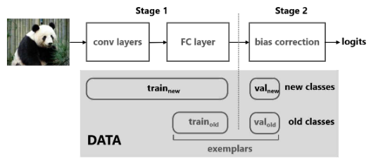

# Large Scale Incremental Learning [(CVPR'2019)](https://openaccess.thecvf.com/content_CVPR_2019/papers/Wu_Large_Scale_Incremental_Learning_CVPR_2019_paper.pdf)

## Abstract

<!-- [ABSTRACT] -->

Modern machine learning suffers from catastrophic forgetting when learning new classes incrementally. The performance dramatically degrades due to the missing data of old classes. Incremental learning methods have been proposed to retain the knowledge acquired from the old classes, by using knowledge distilling and keeping a few exemplars from the old classes. However, these methods struggle to scale up to a large number of classes. We believe this is because of the combination of two factors: (a) the data imbalance between the old and new classes, and (b) the increasing number of visually similar classes. Distinguishing between an increasing number of visually similar classes is particularly challenging, when the training data is unbalanced. We propose a simple and effective method to address this data imbalance issue. We found that the last fully connected layer has a strong bias towards the new classes, and this bias can be corrected by a linear model. With two bias parameters, our method performs remarkably well on two large datasets: ImageNet (1000 classes) and MS-Celeb1M (10000 classes), outperforming the state-of-the-art algorithms by 11.1% and 13.2% respectively.

<!-- [IMAGE] -->



## Citation

<!-- [ALGORITHM] -->

```bibtex
@inproceedings{wu2019large,
  title={Large scale incremental learning},
  author={Wu, Yue and Chen, Yinpeng and Wang, Lijuan and Ye, Yuancheng and Liu, Zicheng and Guo, Yandong and Fu, Yun},
  booktitle={Proceedings of the IEEE/CVF conference on computer vision and pattern recognition (CVPR)},
  pages={374--382},
  year={2019}
}
```

## How to Reproduce bic

- **Step1: Set the path in `run_trainer.py` with `./config/bic.yaml`**
    ```python
    config = Config("./config/bic.yaml").get_config_dict()
    ```
- **Step2: Run command**
    ```python
    python run_trainer.py
    ```

**Note**:

- All the result are trained with single gpu.
- Modifications made to `trainer.py` include the implementation of a two-stage training process for `bic`.
- Conditional checks have been introduced within the code to ascertain whether the second stafe of training should be initiated, ensuring that these changes do not impede the functionality of other algorithms.
- `bic` requires splitting the `buffer` and `new data`, so some conditional statements have been added to the data processing section of `trainer.py` as well.

## Results on cifar100 dataset with 180 episodes

| Method         | 20   | 40    | 60    | 80    | 100   |
| -------------- | ---- | ----- | ----- | ----- | ----- |
| original bic   | 0.84 | 0.747 | 0.679 | 0.613 | 0.567 |
| Ours (stage 1) | 0.89 | 0.705 | 0.650 | 0.578 | 0.514 |
| Ours (stage 2) | 0.89 | 0.725 | 0.687 | 0.628 | 0.578 |

