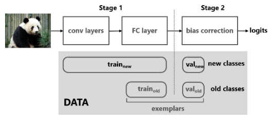

## Large Scale Incremental Learning<a href="http://openaccess.thecvf.com/content_CVPR_2019/papers/Wu_Large_Scale_Incremental_Learning_CVPR_2019_paper.pdf"> (CVPR'2019)</a>

### 摘要

现代机器学习在逐步学习新类时会遭受灾难性遗忘。 由于旧类的数据丢失，性能急剧下降。 人们提出了增量学习方法，通过使用知识提炼和保留旧类中的一些范例来保留从旧类中获得的知识。 然而，这些方法很难扩展到大量类别。 我们认为这是由于两个因素的结合：（a）新旧类别之间的数据不平衡，以及（b）视觉上相似的类别数量不断增加。 当训练数据不平衡时，区分越来越多的视觉相似类尤其具有挑战性。 我们提出了一种简单有效的方法来解决这个数据不平衡问题。 我们发现最后一个全连接层对新类有很强的偏差，这种偏差可以通过线性模型来纠正。 通过两个偏差参数，我们的方法在两个大型数据集上表现得非常好：ImageNet（1000 个类）和 MS-Celeb1M（10000 个类），分别比最优的算法高出 11.1% 和 13.2%。



### 引用

```latex
@inproceedings{wu2019large,
  title={Large scale incremental learning},
  author={Wu, Yue and Chen, Yinpeng and Wang, Lijuan and Ye, Yuancheng and Liu, Zicheng and Guo, Yandong and Fu, Yun},
  booktitle={Proceedings of the IEEE/CVF Conference on Computer Vision and Pattern Recognition},
  pages={374--382},
  year={2019}
}
```

### 运行

修改`run_trainer.py`中的参数为`./config/bic.yaml`

### 注意事项

1、对`trainer.py`的修改：bic有两个训练阶段，为了实现二阶段的训练，`trainer.py`部分加了判断条件来判断是否执行第二个训练阶段（不会影响到其它算法跑通），此外，bic需要对buffer和新数据做split，所以`trainer.py`中也在数据处理的部分加了一些判断条件。

2、任务说明：目前仅能做CIFAR100-5这一任务，若需做其它任务，除了修改超参数之外，还需要修改bias_layers部分以及验证集加载部分。

### 复现精度

| 方法                | 20   | 40    | 60    | 80    | 100   |
| ------------------- | ---- | ----- | ----- | ----- | ----- |
| 原文                | 0.84 | 0.747 | 0.679 | 0.613 | 0.567 |
| Ours(after stage 1) | 0.89 | 0.705 | 0.650 | 0.578 | 0.514 |
| Ours(after stage 2) | 0.89 | 0.725 | 0.687 | 0.628 | 0.578 |

