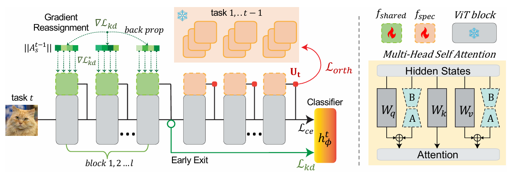

# CL-LoRA: Continual Low-Rank Adaptation for Rehearsal-Free Class-Incremental Learning [(CVPR'2025)](https://arxiv.org/abs/2505.24816)

## Abstract
Class-Incremental Learning (CIL) aims to learn new classes sequentially while retaining the knowledge of previously learned classes. Recently, pre-trained models (PTMs) combined with parameter-efficient fine-tuning (PEFT) have shown remarkable performance in rehearsal-free CIL without requiring exemplars from previous tasks. However, existing adapter-based methods, which incorporate lightweight learnable modules into PTMs for CIL, create new adapters for each new task, leading to both parameter redundancy and failure to leverage shared knowledge across tasks. In this work, we propose ContinuaL Low-Rank Adaptation (CL-LoRA), which introduces a novel dual-adapter architecture combining task-shared adapters to learn cross-task knowledge and task-specific adapters to capture unique features of each new task. Specifically, the shared adapters utilize random orthogonal matrices and leverage knowledge distillation with gradient reassignment to preserve essential shared knowledge. In addition, we introduce learnable block-wise weights for task-specific adapters, which mitigate inter-task interference while maintaining the model's plasticity. We demonstrate CL-LoRA consistently achieves promising performance under multiple benchmarks with reduced training and inference computation, establishing a more efficient and scalable paradigm for continual learning with pre-trained models.



## Citation

```bibtex
@article{He_2025_CVPR,
    author    = {He, Jiangpeng and Duan, Zhihao and Zhu, Fengqing},
    title     = {CL-LoRA: Continual Low-Rank Adaptation for Rehearsal-Free Class-Incremental Learning},
    journal = {Proceedings of the Computer Vision and Pattern Recognition Conference (CVPR)},
    month     = {June},
    year      = {2025},
    pages     = {30534-30544}
}
```
## How to Reproduce

- **Step 1 : Run any of these commands**
    ```python
    python run_trainer.py --config cl_lora-cifar100-b5-5-20
    python run_trainer.py --config cl_lora-imagenetr-b5-5-40
    ```
## Results

* Settings : B{init}-{inc}-{t}, init : init_cls_num, inc : inc_cls_num, t : total_tasks

|   Method   |  Dataset  |  Settings | Reproduced Last Acc | Reported Last Acc | Reproduced Avg Acc | Reported Avg Acc | 
| :--------: | :-------: | :-------: | :-----------------: | :---------------: | :----------------: | :--------------: |
|   CL_LoRA  | Cifar100  |  B5-5-20  |        84.93        |       85.32       |        90.31       |       91.02      | 
|   CL_LoRA  | ImageNetR |  B5-5-40  |        73.27        |       74.51       |        81.40       |       81.58      | 