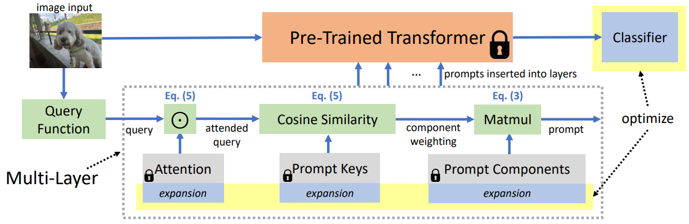

# CODA-Prompt: COntinual Decomposed Attention-based Prompting for Rehearsal-Free Continual Learning [(CVPR' 2023)](https://openaccess.thecvf.com/content/CVPR2023/html/Smith_CODA-Prompt_COntinual_Decomposed_Attention-Based_Prompting_for_Rehearsal-Free_Continual_Learning_CVPR_2023_paper.html)

## Abstract
Computer vision models suffer from a phenomenon known as catastrophic forgetting when learning novel concepts from continuously shifting training data. Typical solutions for this continual learning problem require extensive rehearsal of previously seen data, which increases memory costs and may violate data privacy. Recently, the emergence of large-scale pre-trained vision transformer models has enabled prompting approaches as an alternative to data-rehearsal. These approaches rely on a key-query mechanism to generate prompts and have been found to be highly resistant to catastrophic forgetting in the well-established rehearsal-free continual learning setting. However, the key mechanism of these methods is not trained end-to-end with the task sequence. Our experiments show that this leads to a reduction in their plasticity, hence sacrificing new task accuracy, and inability to benefit from expanded parameter capacity. We instead propose to learn a set of prompt components which are assembled with input-conditioned weights to produce input-conditioned prompts, resulting in a novel attention-based end-to-end key-query scheme. Our experiments show that we outperform the current SOTA method DualPrompt on established benchmarks by as much as 4.5% in average final accuracy. We also outperform the state of art by as much as 4.4% accuracy on a continual learning benchmark which contains both class-incremental and domain-incremental task shifts, corresponding to many practical settings. Our code is available at https://github.com/GT-RIPL/CODA-Prompt



## Citation
```bibtex
@inproceedings{smith2023coda,
  title={Coda-prompt: Continual decomposed attention-based prompting for rehearsal-free continual learning},
  author={Smith, James Seale and Karlinsky, Leonid and Gutta, Vyshnavi and Cascante-Bonilla, Paola and Kim, Donghyun and Arbelle, Assaf and Panda, Rameswar and Feris, Rogerio and Kira, Zsolt},
  booktitle={Proceedings of the IEEE/CVF Conference on Computer Vision and Pattern Recognition},
  pages={11909--11919},
  year={2023}
}
```

## How to Reproduce CodaPrompt

- **Step1: Set the path in `run_trainer.py` with `./config/codaprompt.yaml`**
    ```python
    config = Config("./config/codaprompt.yaml").get_config_dict()
    ```
- **Step2: Run command**
    ```python
    python run_trainer.py
    ```


## Results
| Dataset  |   Backbone     |Num of tasks | Buffer size | Reproduced Accuracy | Reported Accuracy |
| :------: | :------------: |:----------: | :---------: | :-----------------: | :---------------: |
| CIFAR100 |  vit_pt_imnet  | 10          |    0        |        86.22        |      86.33        |