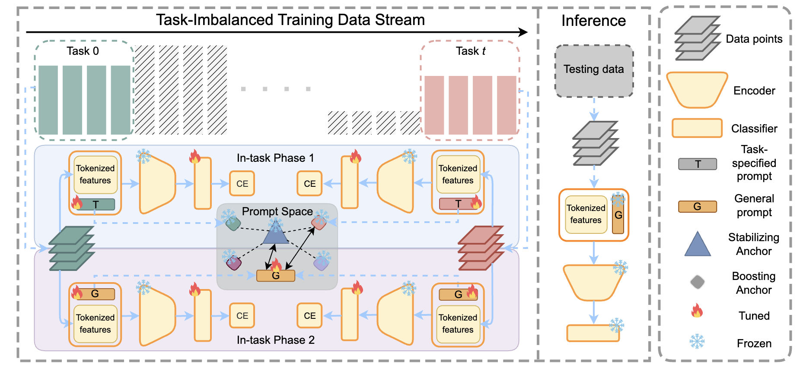

# Dynamically Anchored Prompting for Task-Imbalanced Continual Learning [(IJCAI' 2024)](https://arxiv.org/abs/2404.14721)

## Abstract
Existing continual learning literature relies heavily on a strong assumption that tasks arrive with a balanced data stream, which is often unrealistic in real-world applications. In this work, we explore task-imbalanced continual learning (TICL) scenarios where the distribution of task data is non-uniform across the whole learning process. We find that imbalanced tasks significantly challenge the capability of models to control the trade-off between stability and plasticity from the perspective of recent prompt-based continual learning methods. On top of the above finding, we propose Dynamically Anchored Prompting (DAP), a prompt-based method that only maintains a single general prompt to adapt to the shifts within a task stream dynamically. This general prompt is regularized in the prompt space with two specifically designed prompt anchors, called boosting anchor and stabilizing anchor, to balance stability and plasticity in TICL. Remarkably, DAP achieves this balance by only storing a prompt across the data stream, therefore offering a substantial advantage in rehearsal-free CL. Extensive experiments demonstrate that the proposed DAP results in 4.5% to 15% absolute improvements over state-of-the-art methods on benchmarks under task-imbalanced settings. Our code is available at https://github.com/chenxing6666/DAP



## Citation
```bibtex
@inproceedings{10.24963/ijcai.2024/456,
  author = {Hong, Chenxing and Jin, Yan and Kang, Zhiqi and Chen, Yizhou and Li, Mengke and Lu, Yang and Wang, Hanzi},
  title = {Dynamically anchored prompting for task-imbalanced continual learning},
  booktitle = {Proceedings of the Thirty-Third International Joint Conference on Artificial Intelligence},
  year = {2025},
}
```

## How to Reproduce DAP

- **Step1: Run command**
    ```python
    python run_trainer.py --config dap.yaml
    ```

## Results
| Dataset  |   Backbone     |Num of tasks | Buffer size | Reproduced Accuracy | Reported Accuracy |
| :------: | :------------: |:----------: | :---------: | :-----------------: | :---------------: |
| ltCIFAR100 |  vit_pt_imnet_dap  | 10          |    0        |       56.58         |      56.30        |