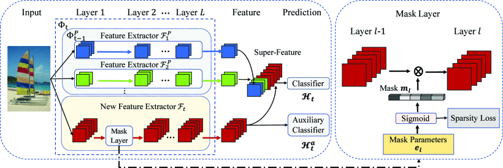

# DER: Dynamically Expandable Representation for Class Incremental Learning [(CVPR'2021)](https://openaccess.thecvf.com/content/CVPR2021/html/Yan_DER_Dynamically_Expandable_Representation_for_Class_Incremental_Learning_CVPR_2021_paper.html)
## Abstract

We address the problem of class incremental learning, which is a core step towards achieving adaptive vision intelligence. In particular, we consider the task setting of incremental learning with limited memory and aim to achieve a better stability-plasticity trade-off. To this end, we propose a novel two-stage learning approach that utilizes a dynamically expandable representation for more effective incremental concept modeling. Specifically, at each incremental step, we freeze the previously learned representation and augment it with additional feature dimensions from a new learnable feature extractor. Moreover, we dynamically expand the representation according to the complexity of novel concepts by introducing a channel-level mask-based pruning strategy. This enables us to integrate new visual concepts with retaining learned knowledge. Furthermore, we introduce an auxiliary loss to encourage the model to learn diverse and discriminate features for novel concepts. We conduct extensive experiments on the three class incremental learning benchmarks and our method consistently outperforms other methods with a large margin.



## Citation

```bibtex
@inproceedings{Yan2021DER,
  author       = {Shipeng Yan and Jiangwei Xie and Xuming He},
  title        = {{DER:} Dynamically Expandable Representation for Class Incremental Learning},
  booktitle    = {Proceedings of the IEEE/CVF conference on computer vision and pattern recognition (CVPR)},
  pages        = {3014--3023},
  year         = {2021},
}
```

## How to Reproduce DER

- **Step1: Set the path in `run_trainer.py` with `./config/der.yaml`**
    ```python
    config = Config("./config/lucir.yaml").get_config_dict()
    ```
- **Step2: Run command**
    ```python
    python run_trainer.py
    ```

## Results and models

| Method | Backbone | Pretrained |  Dataset  | Epochs |    Split    | Precision |
| :----: | :------: | :--------: | :-------: | :----: | :---------: | :-------: |
|  DER   | Resnet18 |   False    | CIFAR-100 |  170   | Base0 Inc10 |  64.90%   |


