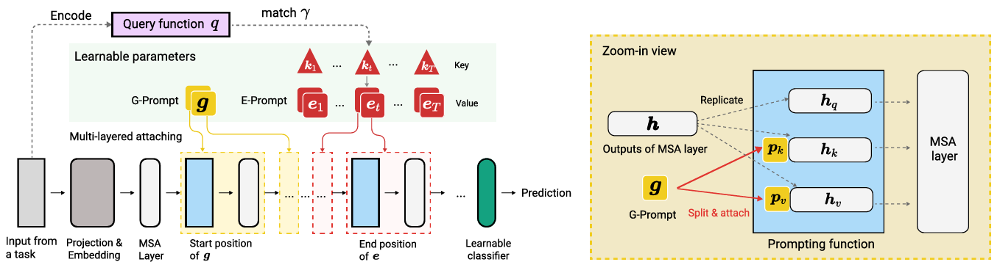

# DualPrompt: Complementary Prompting for Rehearsal-free Continual Learning [(ECCV' 2022)](https://arxiv.org/abs/2204.04799)

## Abstract
Continual learning aims to enable a single model to learn a sequence of tasks without catastrophic forgetting. Top-performing methods usually require a rehearsal buffer to store past pristine examples for experience replay, which, however, limits their practical value due to privacy and memory constraints. In this work, we present a simple yet effective framework, DualPrompt, which learns a tiny set of parameters, called prompts, to properly instruct a pre-trained model to learn tasks arriving sequentially without buffering past examples. DualPrompt presents a novel approach to attach complementary prompts to the pre-trained backbone, and then formulates the objective as learning task-invariant and task-specific “instructions”. With extensive experimental validation, DualPrompt consistently sets state-of-the-art performance under the challenging class-incremental setting. In particular, DualPrompt outperforms recent advanced continual learning methods with relatively large buffer sizes. We also introduce a more challenging benchmark, Split ImageNet-R, to help generalize rehearsal-free continual learning research. Source code is available at https://github.com/google-research/l2p



## Citation
```bibtex
@inproceedings{wang2022dualprompt,
  title={Dualprompt: Complementary prompting for rehearsal-free continual learning},
  author={Wang, Zifeng and Zhang, Zizhao and Ebrahimi, Sayna and Sun, Ruoxi and Zhang, Han and Lee, Chen-Yu and Ren, Xiaoqi and Su, Guolong and Perot, Vincent and Dy, Jennifer and others},
  booktitle={European Conference on Computer Vision},
  pages={631--648},
  year={2022},
  organization={Springer}
}
```

## How to Reproduce DualPrompt

- **Step1: Set the path in `run_trainer.py` with `./config/dualprompt.yaml`**
    ```python
    config = Config("./config/dualprompt.yaml").get_config_dict()
    ```
- **Step2: Run command**
    ```python
    python run_trainer.py
    ```


## Results
| Dataset  |   Backbone     |Num of tasks | Buffer size | Reproduced Accuracy | Reported Accuracy |
| :------: | :------------: |:----------: | :---------: | :-----------------: | :---------------: |
| CIFAR100 |  vit_pt_imnet  | 10          |    0        |        83.21        |      83.69        |