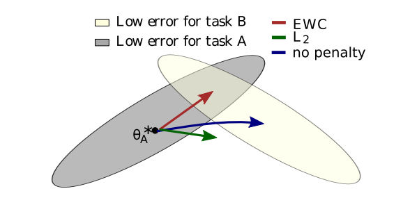

# Overcoming catastrophic forgetting in neural networks [(PNAS' 2017)](https://arxiv.org/abs/1612.00796)

## Abstract
The ability to learn tasks in a sequential fashion is crucial to the development of artificial intelligence. Neural networks are not, in general, capable of this and it has been widely thought that catastrophic forgetting is an inevitable feature of connectionist models. We show that it is possible to overcome this limitation and train networks that can maintain expertise on tasks which they have not experienced for a long time. Our approach remembers old tasks by selectively slowing down learning on the weights important for those tasks. We demonstrate our approach is scalable and effective by solving a set of classification tasks based on the MNIST hand written digit dataset and by learning several Atari 2600 games sequentially.




## Citation
```bibtex
@article{kirkpatrick2017overcoming,
  title={Overcoming catastrophic forgetting in neural networks},
  author={Kirkpatrick, James and Pascanu, Razvan and Rabinowitz, Neil and Veness, Joel and Desjardins, Guillaume and Rusu, Andrei A and Milan, Kieran and Quan, John and Ramalho, Tiago and Grabska-Barwinska, Agnieszka and others},
  journal={Proceedings of the national academy of sciences},
  pages={3521--3526},
  year={2017},
}
```

## How to Reproduce EWC

- **Step1: Set the path in `run_trainer.py` with `./config/ewc.yaml`**
    ```python
    config = Config("./config/ewc.yaml").get_config_dict()
    ```
- **Step2: Run command**
    ```python
    python run_trainer.py
    ```


## Results


|backbone | Dataset | buffer_size | batch_size | init_cls | inc_cls | acc|
| --- | --- | --- | --- | --- | --- | --- | 
| cifar_resnet32|  CIFAR-100 | 2000 | 128 | 50 | 25 | 49.75 | 