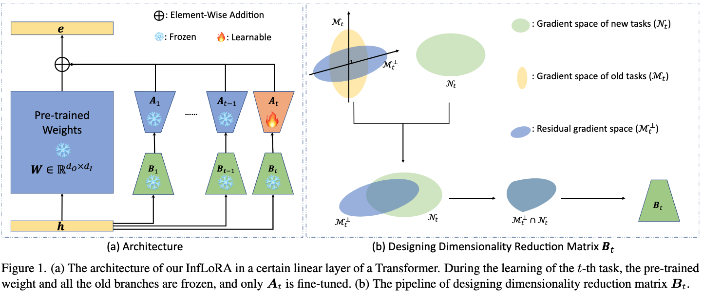

# InfLoRA: Interference-Free Low-Rank Adaptation for Continual Learning [(CVPR&#39;2024)](https://openaccess.thecvf.com/content/CVPR2024/html/Liang_InfLoRA_Interference-Free_Low-Rank_Adaptation_for_Continual_Learning_CVPR_2024_paper.html)

## Abstract
Continual learning requires the model to learn multiple tasks sequentially. In continual learning the model should possess the ability to maintain its performance on old tasks (stability) and the ability to adapt to new tasks continuously (plasticity). Recently parameter-efficient fine-tuning (PEFT) which involves freezing a pre-trained model and injecting a small number of learnable parameters to adapt to downstream tasks has gained increasing popularity in continual learning. Although existing continual learning methods based on PEFT have demonstrated superior performance compared to those not based on PEFT most of them do not consider how to eliminate the interference of the new task on the old tasks which inhibits the model from making a good trade-off between stability and plasticity. In this work we propose a new PEFT method called interference-free low-rank adaptation (InfLoRA) for continual learning. InfLoRA injects a small number of parameters to reparameterize the pre-trained weights and shows that fine-tuning these injected parameters is equivalent to fine-tuning the pre-trained weights within a subspace. Furthermore InfLoRA designs this subspace to eliminate the interference of the new task on the old tasks making a good trade-off between stability and plasticity. Experimental results show that InfLoRA outperforms existing state-of-the-art continual learning methods on multiple datasets.



## Citation

```bibtex
@inproceedings{arXiv:2404.00228v3,
  title        = {InfLoRA: Interference-Free Low-Rank Adaptation for Continual Learning},
  author       = {Yan-Shuo Liang and
                  Wu-Jun Li},
  booktitle    = {{IEEE/CVF} Conference on Computer Vision and Pattern Recognition, {CVPR} 2024, Seattle, Washington},
  publisher    = {Computer Vision Foundation / {IEEE}},
  year         = {2024},
  url          = {https://arxiv.org/abs/2404.00228v3}
}
```

## Optimizing InfLoRA

InfLoRA_opt is an optimized version of InfLoRA . It merges the lora module into weight after every task, reducing the computational cost and improving the performance.

## How to Reproduce InfLoRA

- **Step1: Set the path in `run_trainer.py` with `./config/InfLoRA.yaml` or `./config/InfLoRA_opt.yaml`**
  ```python
  config = Config("./config/InfLoRA.yaml").get_config_dict()
  ```
- **Step2: Run command**
  ```python
  python run_trainer.py
  ```

## Results

| Dataset  | Backbone | Num of tasks | Buffer size | Reproduced Accuracy |             Reported Accuracy             |
| :------: | :------: | :----------: | :---------: | :-----------------: | :---------------------------------------: |
| CIFAR100 |  SiNet   |      10      |      0      |        87.09        |      $86.51 \pm 0.73$(the 10th task)      |
| CIFAR100 |  SiNet   |      10      |      0      |        91.37        | $91.70 \pm 0.32$(the average of 10 tasks) |
