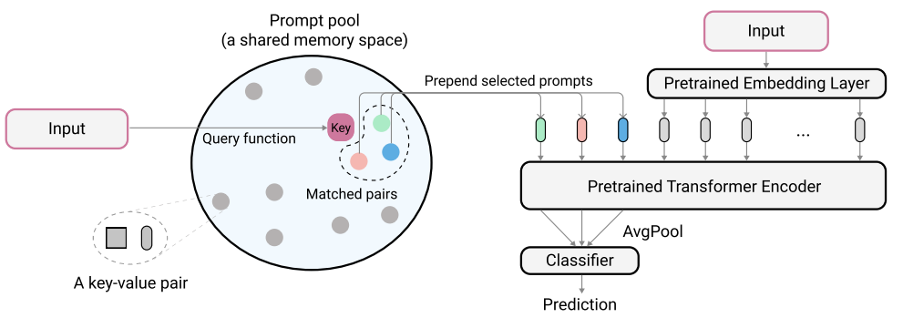

# Learning to Prompt for Continual Learning [(CVPR' 2022)](https://arxiv.org/abs/2112.08654)

## Abstract
The mainstream paradigm behind continual learning has been to adapt the model parameters to non-stationary data distributions, where catastrophic forgetting is the central challenge. Typical methods rely on a rehearsal buffer or known task identity at test time to retrieve learned knowledge and address forgetting, while this work presents a new paradigm for continual learning that aims to train a more succinct memory system without accessing task identity at test time. Our method learns to dynamically prompt (L2P) a pre-trained model to learn tasks sequentially under different task transitions. In our proposed framework, prompts are small learnable parameters, which are maintained in a memory space. The objective is to optimize prompts to instruct the model prediction and explicitly manage task-invariant and task-specific knowledge while maintaining model plasticity. We conduct comprehensive experiments under popular image classification benchmarks with different challenging continual learning settings, where L2P consistently outperforms prior state-ofthe-art methods. Surprisingly, L2P achieves competitive results against rehearsal-based methods even without a rehearsal buffer and is directly applicable to challenging taskagnostic continual learning. Source code is available at https://github.com/google-research/l2p



## Citation
```bibtex
@inproceedings{wang2022learning,
  title={Learning to prompt for continual learning},
  author={Wang, Zifeng and Zhang, Zizhao and Lee, Chen-Yu and Zhang, Han and Sun, Ruoxi and Ren, Xiaoqi and Su, Guolong and Perot, Vincent and Dy, Jennifer and Pfister, Tomas},
  booktitle={Proceedings of the IEEE/CVF Conference on Computer Vision and Pattern Recognition},
  pages={139--149},
  year={2022}
}
```

## How to Reproduce L2P

- **Step1: Set the path in `run_trainer.py` with `./config/l2p.yaml`**
    ```python
    config = Config("./config/l2p-vit-cifar100-b10-10-10.yaml").get_config_dict()
    ```
- **Step2: Run command**
    ```python
    python run_trainer.py
    ```


## Results
| Dataset  |   Backbone     |Num of tasks | Buffer size | Reproduced Accuracy | Reported Accuracy |
| :------: | :------------: |:----------: | :---------: | :-----------------: | :---------------: |
| CIFAR100 |  vit_pt_imnet  | 10          |    0        |       83.56         |       83.83        |