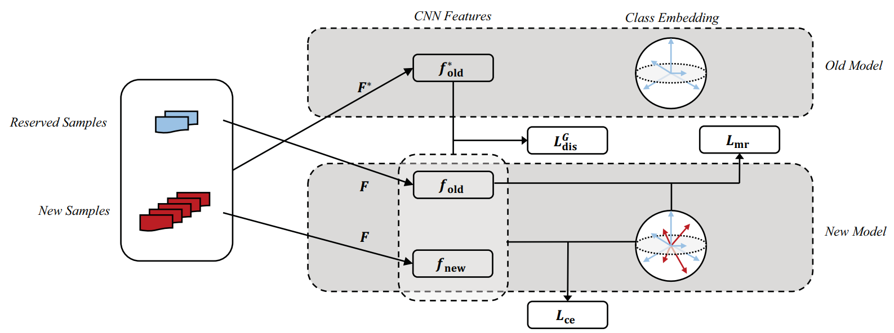

# Learning a Unified Classifier Incrementally via Rebalancing [(CVPR'2019)](https://openaccess.thecvf.com/content_CVPR_2019/html/Hou_Learning_a_Unified_Classifier_Incrementally_via_Rebalancing_CVPR_2019_paper.html)

## Abstract
Conventionally, deep neural networks are trained offline, relying on a large dataset prepared in advance. This paradigm is often challenged in real-world applications, e.g. online services that involve continuous streams of incoming data. Recently, incremental learning receives increasing attention, and is considered as a promising solution to the practical challenges mentioned above. However, it has been observed that incremental learning is subject to a fundamental difficulty – catastrophic forgetting, namely adapting a model to new data often results in severe performance degradation on previous tasks or classes. Our study reveals that the imbalance between previous and new data is a crucial cause to this problem. In this work, we develop a new framework for incrementally learning a unified classifier, i.e. a classifier that treats both old and new classes uniformly. Specifically, we incorporate three components, cosine normalization, less-forget constraint, and inter-class separation, to mitigate the adverse effects of the imbalance. Experiments show that the proposed method can effectively rebalance the training process, thus obtaining superior performance compared to the existing methods. On CIFAR100 and ImageNet, our method can reduce the classification errors by more than 6% and 13% respectively, under the incremental setting of 10 phases.



## Citation
```bibtex
@inproceedings{hou2019learning,
  title={Learning a unified classifier incrementally via rebalancing},
  author={Hou, Saihui and Pan, Xinyu and Loy, Chen Change and Wang, Zilei and Lin, Dahua},
  booktitle={Proceedings of the IEEE/CVF conference on computer vision and pattern recognition (CVPR)},
  pages={831--839},
  year={2019}
}
```

## How to Reproduce LUCIR

- **Step1: Set the path in `run_trainer.py` with `./config/lucir.yaml`**
    ```python
    config = Config("./config/lucir.yaml").get_config_dict()
    ```
- **Step2: Run command**
    ```python
    python run_trainer.py
    ```


## Results


| Dataset  | Num of tasks | Buffer size | Reproduced Accuracy | Reported Accuracy |
| :------: | :----------: | :---------: | :-----------------: | :---------------: |
| CIFAR100 |      2      |    2000     |        63.00         |       62.41        |
| CIFAR100 |      5      |    2000     |        47.40         |       48.91        |