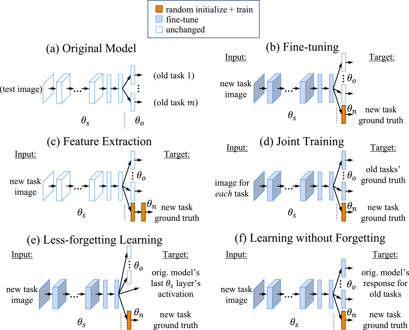

# Learning without Forgetting [(ECCV'2016)](https://ieeexplore.ieee.org/document/8107520)
## Abstract

When building a unified vision system or gradually adding new apabilities to a system, the usual assumption is that training data for all tasks is always available. However, as the number of tasks grows, storing and retraining on such data becomes infeasible. A new problem arises where we add new capabilities to a Convolutional Neural Network (CNN), but the training data for its existing capabilities are unavailable. We propose our Learning without Forgetting method, which uses only new task data to train the network while preserving the original capabilities. Our method performs favorably compared to commonly used feature extraction and fine-tuning adaption techniques and performs similarly to multitask learning that uses original task data we assume unavailable. A more surprising observation is that Learning without Forgetting may be able to replace fine-tuning with similar old and new task datasets for improved new task performance.



## Citation

```bibtex
@inproceedings{Li2018LwF,
  title        = {Learning Without Forgetting},
  author       = {Zhizhong Li and
                  Derek Hoiem},
  booktitle    = {Computer Vision European Conference (ECCV)},
  pages        = {614--629},
  year         = {2016},
}
```

## How to reproduce LWF

- **Step1: Set the path in `run_trainer.py` with `./config/lwf.yaml`**
    ```python
    config = Config("./config/lwf.yaml").get_config_dict()
    ```
- **Step2: Run code**
    ```python
    python run_trainer.py
    ```

## Results and models

| Backbone | Pretrained |  Dataset  | Epochs |    Split    | Precision |
| :------: | :--------: | :-------: | :----: | :---------: | :-------: |
| Resnet18 |   False    | CIFAR-100 |  100   | Base0 Inc10 |  43.00%   |
| Resnet18 |   False    | CIFAR-100 |  100   | Base0 Inc5 |  43.90%   |


