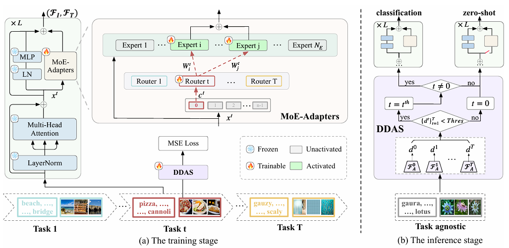

# Boosting Continual Learning of Vision-Language Models via Mixture-of-Experts Adapters[(CVPR'2024)](https://arxiv.org/abs/2403.11549)

## Abstract
Continual learning can empower vision-language models to continuously acquire new knowledge, without the need for access to the entire historical dataset. However, mitigating the performance degradation in large-scale models is non-trivial due to (i) parameter shifts throughout lifelong learning and (ii) significant computational burdens associated with full-model tuning. In this work, we present a parameter-efficient continual learning framework to alleviate long-term forgetting in incremental learning with vision-language models. Our approach involves the dynamic expansion of a pre-trained CLIP model, through the integration of Mixture-of-Experts (MoE) adapters in response to new tasks. To preserve the zero-shot recognition capability of vision-language models, we further introduce a Distribution Discriminative Auto-Selector (DDAS) that automatically routes in-distribution and out-of-distribution inputs to the MoE Adapter and the original CLIP, respectively. Through extensive experiments across various settings, our proposed method consistently outperforms previous state-of-the-art approaches while concurrently reducing parameter training burdens by 60%.



## Citation
```bibtex
@inproceedings{yu2024boosting,
  title={Boosting continual learning of vision-language models via mixture-of-experts adapters},
  author={Yu, Jiazuo and Zhuge, Yunzhi and Zhang, Lu and Hu, Ping and Wang, Dong and Lu, Huchuan and He, You},
  booktitle={Proceedings of the IEEE/CVF Conference on Computer Vision and Pattern Recognition},
  pages={23219--23230},
  year={2024}
}
```

## How to Reproduce MoE_Adapter4CL

- **Step 1 : Configure `./config/moe_adapter4cl.yaml`

- **Step 2 : Run command**
    ```python
    python run_trainter.py --config_name moe_adapter4cl
    ```

## Results

| Dataset  | Backbone |   Settings   | Reproduced Overall Accuracy | Reported Overall Accuracy |
| :------: | :------: | :----------: | :-------------------------: | :-----------------------: |
| CIFAR100 |   CLIP   |   B10-10-10  |            85.49            |           85.21           |
| CIFAR100 |   CLIP   |   B5-5-20    |            86.51            |           83.72           |
| CIFAR100 |   CLIP   |   B2-2-50    |            xx.xx            |           83.60           |

|   Dataset    | Backbone |   Settings    | Reproduced Overall Accuracy | Reported Overall Accuracy |
| :----------: | :------: | :-----------: | :-------------------------: | :-----------------------: |
| TinyImageNet |   CLIP   |   B100-5-21   |            80.10            |           79.96           |
| TinyImageNet |   CLIP   |   B100-10-11  |            80.43            |           80.23           |
| TinyImageNet |   CLIP   |   B100-20-6   |            80.88            |           81.12           |