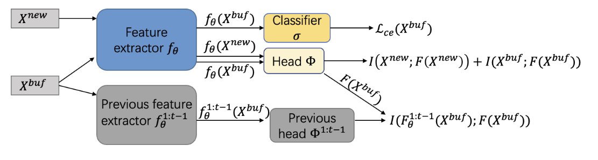

# Online Continual Learning through Mutual Information Maximization [(ICML'2021)](https://proceedings.mlr.press/v162/guo22g.html)

## Abstract

This paper proposes a new online continual learning technique called OCM based on mutual information maximization. It achieves two objectives that are critical in dealing with catastrophic forgetting (CF). (1) It reduces feature bias caused by cross entropy (CE) as CE learns only discriminative features for each task, but these features may not be discriminative for another task. To learn a new task well, the network parameters learned before have to be modified, which causes CF. The new approach encourages the learning of each task to make use of holistic representations or the full features of the task training data. (2) It encourages preservation of the previously learned knowledge when training a new batch of incrementally arriving data. Empirical evaluation shows that OCM substantially outperforms the online CL baselines. For example, for CIFAR10, OCM improves the accuracy of the best baseline by 13.1% from 64.1% (baseline) to 77.2% (OCM). The code is publicly available at https://github.com/gydpku/OCM.



## Citation

```bibtex
@inproceedings{guo2022online,
  title={Online continual learning through mutual information maximization},
  author={Guo, Yiduo and Liu, Bing and Zhao, Dongyan},
  booktitle={International Conference on Machine Learning (ICML)},
  pages={8109--8126},
  year={2022}
}
```

## How to Reproduce OCM

- **Step1: Set the path in `run_trainer.py` with `./config/ocm.yaml`**
    ```python
    config = Config("./config/ocm.yaml").get_config_dict()
    ```
- **Step2: Run command**
    ```python
    python run_trainer.py
    ```


## Notes

`OCM` is an online continual learning method, so it requires the use of a specific `OnlineBuffer`. Therefore, the `buffer` section in your configuration file should be configured as follows:

```yaml
buffer:
  name: OnlineBuffer
  kwargs:
    buffer_size: 5000
    batch_size: 64
    input_size: [3, 32, 32]
```


## Results on CIFAR100 dataset

| Dataset  | Num of tasks | Buffer size | Reproduced Accuracy | Reported Accuracy |
| :------: | :----------: | :---------: | :-----------------: | :---------------: |
| CIFAR100 |      10      |    1000     |        28.6         |       28.1        |
| CIFAR100 |      10      |    2000     |        35.7         |       35.0        |
| CIFAR100 |      10      |    5000     |        41.0         |       42.4        |

