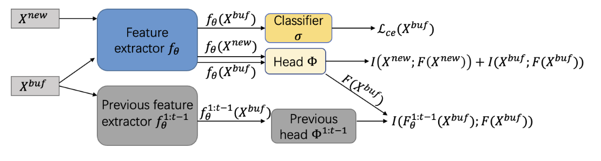

# Online Continual Learning through Mutual Information Maximization [(ICML'2022)](https://proceedings.mlr.press/v162/guo22g.html)

## 摘要

This paper proposes a new online continual learning technique called OCM based on mutual information maximization. It achieves two objectives that are critical in dealing with catastrophic forgetting (CF). (1) It reduces feature bias caused by cross entropy (CE) as CE learns only discriminative features for each task, but these features may not be discriminative for another task. To learn a new task well, the network parameters learned before have to be modified, which causes CF. The new approach encourages the learning of each task to make use of holistic representations or the full features of the task training data. (2) It encourages preservation of the previously learned knowledge when training a new batch of incrementally arriving data. Empirical evaluation shows that OCM substantially outperforms the online CL baselines. For example, for CIFAR10, OCM improves the accuracy of the best baseline by 13.1% from 64.1% (baseline) to 77.2% (OCM). The code is publicly available at https://github.com/gydpku/OCM.

## 引用

~~~bibtex
@inproceedings{guo2022online,
  title={Online continual learning through mutual information maximization},
  author={Guo, Yiduo and Liu, Bing and Zhao, Dongyan},
  booktitle={International Conference on Machine Learning},
  pages={8109--8126},
  year={2022}
}
~~~

## 如何复现OCM

包含两个步骤：

* **步骤1: 修改配置**
  * 修改 `run_trainer.py` 文件中的配置文件为`"./config/ocm cifar100.yaml"`.

  * 例子： `config = Config("./config/ocm cifar100.yaml").get_config_dict()`

* **步骤2: 运行trainer主程序**
  * 执行下列语句：`python run_trainer.py`

## 注意事项

`OCM`是一个在线的持续学习方法，因此需要使用特定的`OnlineBuffer`。因此，你的配置文件中关于`buffer`的部分应该配置如下：

~~~yaml
buffer:
  name: OnlineBuffer
  kwargs:
    buffer_size: 5000
    batch_size: 64
    input_size: [3, 32, 32]
~~~

## CIFAR100数据集上的结果

|  数据集  | 任务数量 | 缓存样本数 | 复现准确度 | 原文准确度 |
| :------: | :------: | :--------: | :--------: | :--------: |
| CIFAR100 |    10    |    1000    |    28.6    |    28.1    |
| CIFAR100 |    10    |    2000    |    35.7    |    35.0    |
| CIFAR100 |    10    |    5000    |    41.0    |    42.4    |

