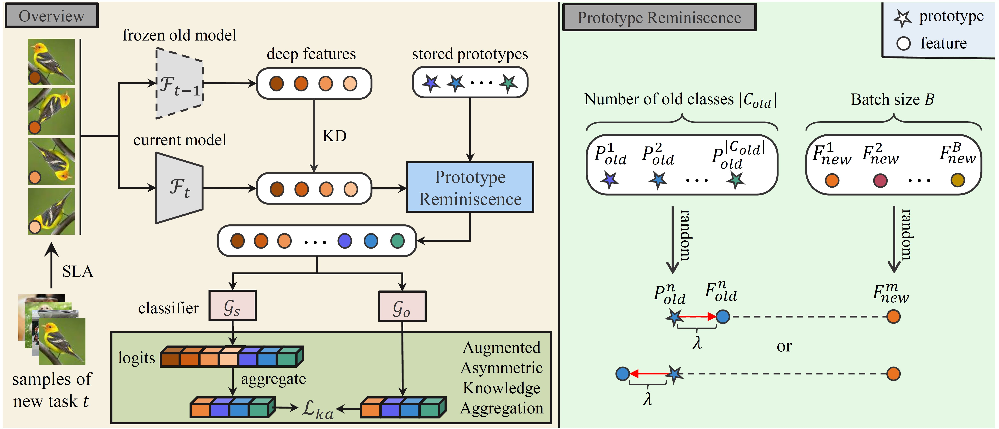

# Prototype Reminiscence and Augmented Asymmetric Knowledge Aggregation for Non-Exemplar Class-Incremental Learning [(ICCV' 2023)](https://openaccess.thecvf.com/content/ICCV2023/papers/Shi_Prototype_Reminiscence_and_Augmented_Asymmetric_Knowledge_Aggregation_for_Non-Exemplar_Class-Incremental_ICCV_2023_paper.pdf)

## Abstract
Non-exemplar class-incremental learning(NECIL) requires deep models to maintain existing knowledge while continuously learning new classes without saving old class samples. In NECIL methods, prototypical representations are usually stored, which inject information from former classes to resist catastrophic forgetting in subsequent incremental learning. However, since the model continuously learns new knowledge, the stored prototypical representations cannot correctly model the properties of old classes in the existence of knowledge updates. To address this problem, we propose a novel prototype reminiscence mechanism that incorporates the previous class prototypes with arriving new class features to dynamically reshape old class feature distributions thus preserving the decision boundaries of previous tasks. In addition, to improve the model generalization on both newly arriving classes and old classes, we contribute an augmented asymmetric knowledge aggregation approach, which aggregates the overall knowledge of the current task and extracts the valuable knowledge of the past tasks, on top of self-supervised label augmentation. Experimental results on three benchmarks suggest the superior performance of our approach over the SOTA methods.




## Citation
If you use this code for your research, please consider citing:

```
@inproceedings{shi2023prototype,
  title={Prototype Reminiscence and Augmented Asymmetric Knowledge Aggregation for Non-Exemplar Class-Incremental Learning},
  author={Shi, Wuxuan and Ye, Mang},
  booktitle={Proceedings of the IEEE/CVF International Conference on Computer Vision},
  pages={1772--1781},
  year={2023}
}
```

## How to Reproduce PRAKA

- **Step1: Set the path in `run_trainer.py` with `./config/praka.yaml`**
    ```python
    config = Config("./config/praka.yaml").get_config_dict()
    ```
- **Step2: Run command**
    
    ```python
    python run_trainer.py
    ```

| Dataset  | Num of Tasks | Buffer Size | Reproduced Average Accuracy | Reported Average Accuracy |
| :------: | :----------: | :---------: | :-------------------------: | :-----------------------: |
| CIFAR100 |      5       |      0      |            69.54            |           70.02           |
| CIFAR100 |      10      |      0      |            67.12            |           68.86           |

