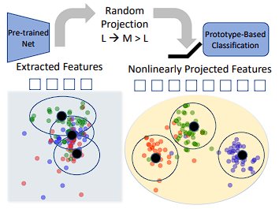

# RanPAC: Random Projections and Pre-trained Models for Continual Learning [(NeurIPS 2023)](https://arxiv.org/abs/2307.02251)

## Abstract
Continual learning (CL) aims to incrementally learn different tasks (such as classification) in a non-stationary data stream without forgetting old ones. Most CL works focus on tackling catastrophic forgetting under a learning-from-scratch paradigm. However, with the increasing prominence of foundation models, pre-trained models equipped with informative representations have become available for various downstream requirements. Several CL methods based on pre-trained models have been explored, either utilizing pre-extracted features directly (which makes bridging distribution gaps challenging) or incorporating adaptors (which may be subject to forgetting). In this paper, we propose a concise and effective approach for CL with pre-trained models. Given that forgetting occurs during parameter updating, we contemplate an alternative approach that exploits training-free random projectors and class-prototype accumulation, which thus bypasses the issue. Specifically, we inject a frozen Random Projection layer with nonlinear activation between the pre-trained model's feature representations and output head, which captures interactions between features with expanded dimensionality, providing enhanced linear separability for class-prototype-based CL. We also demonstrate the importance of decorrelating the class-prototypes to reduce the distribution disparity when using pre-trained representations. These techniques prove to be effective and circumvent the problem of forgetting for both class- and domain-incremental continual learning. Compared to previous methods applied to pre-trained ViT-B/16 models, we reduce final error rates by between 20% and 62% on seven class-incremental benchmarks, despite not using any rehearsal memory. We conclude that the full potential of pre-trained models for simple, effective, and fast CL has not hitherto been fully tapped.



## Citation

```bibtex
@misc{mcdonnell2024ranpacrandomprojectionspretrained,
      title={RanPAC: Random Projections and Pre-trained Models for Continual Learning}, 
      author={Mark D. McDonnell and Dong Gong and Amin Parveneh and Ehsan Abbasnejad and Anton van den Hengel},
      year={2024},
      eprint={2307.02251},
      archivePrefix={arXiv},
      primaryClass={cs.LG},
      url={https://arxiv.org/abs/2307.02251}, 
}
```

## How to Reproduce RanPAC

- **Step1: Set the path in `run_trainer.py` with `./config/ranpac.yaml`**
  ```python
  config = Config("./config/ranpac.yaml").get_config_dict()
  ```
- **Step2: Run command**
  ```python
  python run_trainer.py
  ```

## Results

| Dataset  | Backbone | Num of tasks | Buffer size | Reproduced Accuracy |  Reported Accuracy  |
| :------: | :------: | :----------: | :---------: | :-----------------: | :-----------------: |
| CIFAR100 |    ViT   |      10      |      0      |        92.22        |        92.11        |

