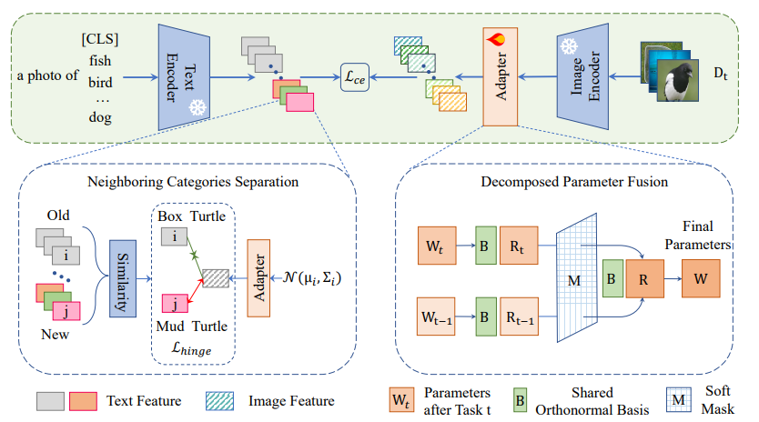

# Class-Incremental Learning with CLIP: Adaptive Representation Adjustment and Parameter Fusion [(ECCV 2024)](https://arxiv.org/abs/2407.14143)

## Abstract
Class-incremental learning is a challenging problem, where the goal is to train a model that can classify data from an increasing number of classes over time. With the advancement of vision-language pre-trained models such as CLIP, they demonstrate good generalization ability that allows them to excel in class-incremental learning with completely frozen parameters. However, further adaptation to downstream tasks by simply fine-tuning the model leads to severe forgetting. Most existing works with pre-trained models assume that the forgetting of old classes is uniform when the model acquires new knowledge. In this paper, we propose a method named Adaptive Representation Adjustment and Parameter Fusion (RAPF). During training for new data, we measure the influence of new classes on old ones and adjust the representations, using textual features. After training, we employ a decomposed parameter fusion to further mitigate forgetting during adapter module fine-tuning. Experiments on several conventional benchmarks show that our method achieves state-of-the-art results. Our code is available at [this URL](https://github.com/linlany/RAPF).



## How to Reproduce RanPAC

- **Step1: Set the path in `run_trainer.py` with `./config/trgp.yaml`**
  ```python
  config = Config("./config/rapf10-10.yaml").get_config_dict()
  config = Config("./config/rapf50-10.yaml").get_config_dict()
  config = Config("./config/rapf50-5.yaml").get_config_dict()
  ```
- **Step2: Run command**
  ```python
  python run_trainer.py
  ```

## Results
| Dataset    | Config | Reproduced (avg, last) | Reported (avg, last)  |
|------------|--------|------------------------|-----------------------|
| CIFAR-100  | 10-10  | (85.97, 78.85)         | (86.87, 79.26)        |
| CIFAR-100  | 50-10  | (84.39, 79.58)         | (84.73, 79.36)        |
| CIFAR-100  | 50-5   | (84.41, 79.77)         | (85.03, 79.64)        |
