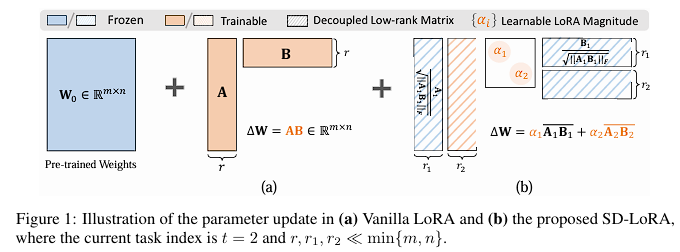

# SD-LoRA: Scalable Decoupled Low-Rank Adaptation for Class Incremental Learning [(ICLR'2025)](https://arxiv.org/abs/2501.13198)

## Abstract
Continual Learning (CL) with foundation models has recently emerged as a promising paradigm to exploit abundant knowledge acquired during pre-training for tackling sequential tasks. However, existing prompt-based and Low-Rank Adaptation-based (LoRA-based) methods often require expanding a prompt/LoRA pool or retaining samples of previous tasks, which poses significant scalability challenges as the number of tasks grows. To address these limitations, we propose Scalable Decoupled LoRA (SD-LoRA) for class incremental learning, which continually separates the learning of the magnitude and direction of LoRA components without rehearsal. Our empirical and theoretical analysis reveals that SD-LoRA tends to follow a low-loss trajectory and converges to an overlapping low-loss region for all learned tasks, resulting in an excellent stability-plasticity trade-off. Building upon these insights, we introduce two variants of SD-LoRA with further improved parameter efficiency. All parameters of SD-LoRAs can be end-to-end optimized for CL objectives. Meanwhile, they support efficient inference by allowing direct evaluation with the finally trained model, obviating the need for component selection. Extensive experiments across multiple CL benchmarks and foundation models consistently validate the effectiveness of SD-LoRA.



## Citation

```bibtex
@misc{wu2025sdlorascalabledecoupledlowrank,
      title={SD-LoRA: Scalable Decoupled Low-Rank Adaptation for Class Incremental Learning}, 
      author={Yichen Wu and Hongming Piao and Long-Kai Huang and Renzhen Wang and Wanhua Li and Hanspeter Pfister and Deyu Meng and Kede Ma and Ying Wei},
      year={2025},
      eprint={2501.13198},
      archivePrefix={arXiv},
      primaryClass={cs.LG},
      url={https://arxiv.org/abs/2501.13198}, 
}
```
## How to Reproduce

- **Step 1 : Run any of these commands**
    ```python
    python run_trainer.py --config sd_lora-vit-cifar100-b10-10-10
    python run_trainer.py --config sd_lora-vit-imagenetr-b10-10-20
    python run_trainer.py --config sd_lora-vit-imagenetr-b20-20-10
    python run_trainer.py --config sd_lora-vit-imagenetr-b40-40-5
    ```
## Results

* Settings : B{init}-{inc}-{t}, init : init_cls_num, inc : inc_cls_num, t : total_tasks
* The source code utilizes different hyperparameters—such as the optimizer, learning rate, and number of epochs compared to those specified in the papers. 
* We have chosen to adhere to the configurations defined in the source code.

|   Method   |  Dataset  |  Settings | Reproduced Last Acc | Reported Last Acc | Reproduced Avg Acc | Reported Avg Acc | 
| :--------: | :-------: | :-------: | :-----------------: | :---------------: | :----------------: | :--------------: |
|   SD_LoRA  | Cifar100  | B10-10-10 |        87.16        |       88.01       |        92.21       |       92.54      | 
|   SD_LoRA  | ImageNetR | B10-10-20 |        76.20        |       75.26       |        81.38       |       80.22      | 
|   SD_LoRA  | ImageNetR | B20-20-10 |        78.35        |       77.34       |        83.16       |       82.04      | 
|   SD_LoRA  | ImageNetR | B40-40-5  |        79.97        |       79.15       |        83.45       |       83.01      | 

|   Method    |  Dataset  |  Settings | Reproduced Last Acc | Reported Last Acc | Reproduced Avg Acc | Reported Avg Acc | 
| :---------: | :-------: | :-------: | :-----------------: | :---------------: | :----------------: | :--------------: |
|  SD_LoRA-RR | Cifar100  | B10-10-10 |        87.14        |       87.26       |        92.27       |       92.05      | 
|  SD_LoRA-RR | ImageNetR | B10-10-20 |        75.92        |       74.05       |        81.43       |       80.65      | 
|  SD_LoRA-RR | ImageNetR | B20-20-10 |        78.73        |       77.18       |        83.18       |       81.74      | 
|  SD_LoRA-RR | ImageNetR | B40-40-5  |        80.08        |       79.01       |        83.48       |       82.50      | 

|   Method    |  Dataset  |  Settings | Reproduced Last Acc | Reported Last Acc | Reproduced Avg Acc | Reported Avg Acc | 
| :---------: | :-------: | :-------: | :-----------------: | :---------------: | :----------------: | :--------------: |
|  SD_LoRA-KD | Cifar100  | B10-10-10 |        86.75        |       87.09       |        91.92       |       92.01      | 
|  SD_LoRA-KD | ImageNetR | B10-10-20 |        76.00        |       74.12       |        81.48       |       80.11      | 
|  SD_LoRA-KD | ImageNetR | B20-20-10 |        78.90        |       77.03       |        83.08       |       81.52      | 
|  SD_LoRA-KD | ImageNetR | B40-40-5  |        79.87        |       78.85       |        83.20       |       82.47      | 
