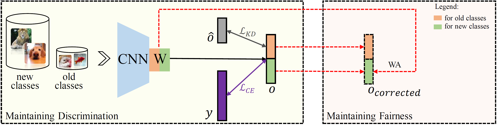

# Maintaining Discrimination and Fairness in Class Incremental Learning [(CVPR'2020)](https://arxiv.org/abs/1911.07053)

## Abstract

Deep neural networks (DNNs) have been applied in class incremental learning, which aims to solve common real-world problems of learning new classes continually. One drawback of standard DNNs is that they are prone to catastrophic forgetting. Knowledge distillation (KD) is a commonly used technique to alleviate this problem. In this paper, we demonstrate it can indeed help the model to output more discriminative results within old classes. However, it cannot alleviate the problem that the model tends to classify objects into new classes, causing the positive effect of KD to be hidden and limited. We observed that an important factor causing catastrophic forgetting is that the weights in the last fully connected (FC) layer are highly biased in class incremental learning. In this paper, we propose a simple and effective solution motivated by the aforementioned observations to address catastrophic forgetting. Firstly, we utilize KD to maintain the discrimination within old classes. Then, to further maintain the fairness between old classes and new classes, we propose Weight Aligning (WA) that corrects the biased weights in the FC layer after normal training process. Unlike previous work, WA does not require any extra parameters or a validation set in advance, as it utilizes the information provided by the biased weights themselves. The proposed method is evaluated on ImageNet-1000, ImageNet-100, and CIFAR-100 under various settings. Experimental results show that the proposed method can effectively alleviate catastrophic forgetting and significantly outperform state-of-the-art methods.




## Citation

```bibtex
@inproceedings{zhao2020maintaining,
  title={Maintaining discrimination and fairness in class incremental learning},
  author={Zhao, Bowen and Xiao, Xi and Gan, Guojun and Zhang, Bin and Xia, Shu-Tao},
  booktitle={Proceedings of the IEEE/CVF conference on computer vision and pattern recognition (CVPR)},
  pages={13208--13217},
  year={2020}
}
```

## How to Reproduce WA

- **Step1: Set the path in `run_trainer.py` with `./config/wa.yaml`**
    ```python
    config = Config("./config/wa.yaml").get_config_dict()
    ```
- **Step2: Run command**
    ```python
    python run_trainer.py
    ```


## Results on CIFAR-100 dataset

|   Arch   | Input Size | Batch Size | Buffer Size | Epochs | Task Number | Average ACC |
| :------: | :--------: | :--------: | :---------: | :----: | :---------: | :---------: |
| resnet32 |   32x32    |    128     |    2000     |  250   |      5      |    47.2%    |

Note: The paper of WA only used a buffer size of 2000 for the experiment.
