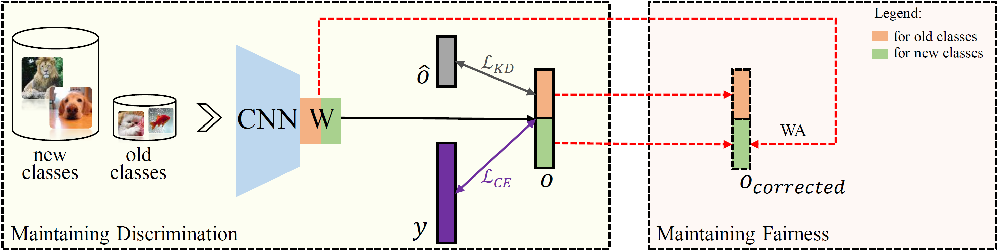

# Maintaining Discrimination and Fairness in Class Incremental Learning [(CVPR'2020)](https://arxiv.org/abs/1911.07053)

## 摘要

深度神经网络（DNN）已被应用于类别增量学习，旨在解决不断学习新类别的常见现实问题。标准DNN的一个缺点是它们容易发生灾难性遗忘。知识蒸馏（KD）是缓解这一问题的常用技术。在本文中，我们证明了它确实可以帮助模型在旧类中输出更多的判别结果。然而，它并不能缓解模型倾向于将目标分类到新的类中的问题，导致KD的积极作用被隐藏和限制。我们观察到，导致灾难性遗忘的一个重要因素是，在类别增量学习中，最后一个全连接（FC）层中的权重具有高度偏差。在本文中，我们提出了一个简单有效的解决方案，以解决灾难性遗忘问题。首先，我们利用KD来维持旧类别内部的可分性。然后，为了进一步保持旧类和新类之间的公平性，我们提出了在正常训练过程后校正FC层中有偏差的权重，即权重对齐（WA）。与之前的工作不同，WA不需要任何额外的参数或预先设置验证集，因为它利用了有偏权重本身提供的信息。在ImageNet-1000、ImageNet-100和CIFAR-100上，在各种设置下对所提出的方法进行了评估。实验结果表明，该方法能够有效地缓解灾难性遗忘，显著优于现有的方法。




## 引用

```bibtex
@inproceedings{zhao2020maintaining,
  title={Maintaining discrimination and fairness in class incremental learning},
  author={Zhao, Bowen and Xiao, Xi and Gan, Guojun and Zhang, Bin and Xia, Shu-Tao},
  booktitle={Proceedings of the IEEE/CVF conference on computer vision and pattern recognition},
  pages={13208--13217},
  year={2020}
}
```

## 如何复现WA

复现包括两个步骤：

- **步骤一**: 在`wa.yaml`中设置数据集的路径，并将`run_trainer.py`中的`Config`修改为`/config/wa.yaml`。
- **步骤二**: 执行`python run_trainer.py`。


## CIFAR-100数据集上的结果

| 骨干网络 | 输入大小 | 批次大小 | 缓存大小 | 任务数 | 平均精度 |
| :------: | :------: | :------: | :------: | :----: | :------: |
| resnet32 |  32x32   |   128    |   2000   |   5    |  50.27   |

注：WA原论文只采用了2000的缓存大小进行实验。